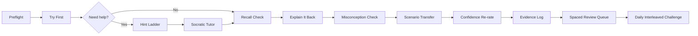
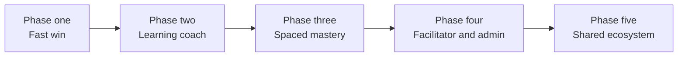

# Designing Professional Development Apps That Teach How to Learn With AI

## Executive summary

Your apps should become **guided practice systems**, not primarily content libraries, chat panes, or quiz wrappers. The core shift is from “read this and answer a few questions” to a repeated loop of **plan → try → get a hint → retrieve → explain → apply → review later**. That direction is strongly aligned with the best-supported learning techniques in cognitive and educational psychology: practice testing and distributed practice are high-utility; self-explanation, elaboration, and interleaving are promising when used deliberately; metacognitive planning, monitoring, and evaluation work best when embedded inside real tasks and real subjects, not added as generic reflection at the end. citeturn17view0turn27view0turn27view2turn28view0

The most important design principle is simple: **make learner thinking visible before AI help appears**. UNESCO’s current guidance is explicitly human-centred and says AI should enhance human agency rather than replace it; its teacher framework also stresses that AI should complement, not replace, teachers’ roles. Recent studies of AI-supported learning show why that matters: students often know that good prompting requires effort, but default to efficiency; cognitive progression gets truncated; short AI-literacy interventions alone do not reliably reduce over-reliance; and appropriate reliance is associated with stronger literacy, self-efficacy, and need for cognition rather than with trust alone. citeturn31view0turn30view0turn4academia3turn32academia2turn32academia4

So the behavioural target for learners is not “use AI well” in the abstract. It is much more concrete: **state what you already know, attempt first, request the smallest useful hint, check your confidence, explain the idea back in plain language, and revisit it later in a spaced review queue**. For teachers, ICT staff, and adult learners, the same loop holds, but the tasks vary: lesson design and assessment for teachers, troubleshooting and documentation for ICT staff, and case-based judgement and communication for workplace learners. citeturn27view0turn17view0turn21view0turn37academia0turn37academia3

What to avoid is equally clear. Do not lead with open chat. Do not let AI answer before the learner has attempted. Do not confuse exposure with learning. Do not overload dashboards with parallel feature sets. Do not treat “AI literacy” as a one-off warning page. And do not log sensitive school or client data into prompts without sanitisation and clear boundaries. UNESCO’s generative AI guidance specifically highlights privacy, validation, and preparedness gaps, and broader reviews of LLMs in education consistently flag transparency, privacy, and human-centred design as unresolved practical issues. citeturn31view0turn33academia3

The brief for this report, the desired app ecosystem, and the named cross-app features come from your uploaded design prompt. fileciteturn0file0

| Decision area | Recommendation |
|---|---|
| What the apps should become | A cross-app **learning coach layer** wrapped around modules, scenarios, quizzes, and roleplays |
| What learners should do differently | Preflight their thinking, attempt first, retrieve from memory, explain back, and review later |
| How AI should be used | As a **hint ladder, Socratic tutor, misconception checker, and feedback coach** |
| What to avoid | Answer-first chat, passive reading, shallow gamification, hidden AI dependence, privacy leakage |
| First thing to build | **TryFirstGate + ExplainItBackBox + ConfidenceMeter** across modules, quizzes, and scenarios |

## Research synthesis

The strongest evidence base points in one direction: if you want an app to teach people *how to learn*, it must create **constructive effort**, not merely convenient access. Dunlosky and colleagues’ major review found that **practice testing** and **distributed practice** had the strongest general utility across ages, tasks, and contexts; **elaborative interrogation**, **self-explanation**, and **interleaving** were promising but more context-sensitive; by contrast, familiar habits like rereading and highlighting were much weaker than many learners assume. That alone justifies redesigning any reading-heavy PD flow around retrieval, explanation, and scheduled review. citeturn17view0

Metacognition matters because learners often misread fluency as mastery. The EEF’s updated metacognition guidance emphasises planning, monitoring, and evaluating, and notes that these approaches work best when embedded in curriculum and subject lessons rather than taught as detached “study skills”. In app terms, that means every module, scenario, strict quiz, and roleplay should begin with a short preflight and end with a confidence check plus reflection on what changed. citeturn27view0

Retrieval practice matters because memory is strengthened by bringing information *out* of the mind, not just putting more in. Roediger and Karpicke’s classic work showed that testing improved long-term retention relative to further study, and Dunlosky’s review rated practice testing as high utility. For your apps, that means replacing long explanation blocks with frequent blank-response moments, recall prompts, one-minute teach-backs, and low-stakes but unavoidable retrieval checkpoints. This applies equally to students, teachers, school ICT staff, and adult workplace learners because all four groups need dependable recall under pressure, not just short-term recognition. citeturn17view1turn17view0

Spacing matters because cramming produces a feeling of progress that does not last. Distributed practice was also rated high utility by Dunlosky, and later review work has kept reinforcing that spaced learning produces stronger long-term retention than massed study. For app design, that means “completion” should never be the end state. Every meaningful encounter should spawn future review tasks, with light but persistent scheduling. The ideal mental model is not “finished module”; it is “first encounter recorded, next review scheduled”. citeturn17view0turn19academia0

Interleaving matters because real work almost never announces the problem type in advance. Rohrer and Taylor showed that shuffling mathematics problems improved delayed learning, and Dunlosky rated interleaving as moderately useful but underused. For your apps, interleaving should appear as mixed daily challenges, mixed scenario sets, and review queues that rotate recall, judgement, explanation, and application rather than repeating one format until completion. That is especially important for ICT troubleshooting, where the real skill is often recognising what kind of problem you are facing before you know how to solve it. citeturn21view0turn17view0

Elaboration and self-explanation matter because understanding deepens when learners connect new material to what they already know and explain causal steps in their own words. Dunlosky rated elaborative interrogation and self-explanation as moderate-utility techniques, and Chi’s body of work has consistently shown that self-explanatory activity is more productive than passive exposure. In app terms, this points directly to an **Explain-It-Back** box, an **analogy builder**, and “why this step?” prompts within worked examples and scenario debriefs. citeturn17view0turn23search2turn34search6

Desirable difficulty is the right design philosophy for your AI layer. The point is not to make learning feel hard for its own sake; the point is to introduce the *right amount* of friction so that encoding, retrieval, discrimination, and transfer improve over time. Retrieval practice, spacing, and interleaving are all desirable-difficulty mechanisms when they remain achievable. This is why the AI should use a **hint ladder** and **faded support**, not immediate full solutions. Done properly, the app feels supportive but does not remove the learner’s obligation to think. citeturn41search0turn17view0turn21view0

Formative feedback helps only when it changes the next learner move. The EEF feedback guidance states plainly that all feedback is not helpful; badly designed feedback can waste time or even harm progress. Hattie and Timperley likewise frame good feedback around reducing the gap between current and desired performance. In your apps, feedback should therefore answer three questions: **What was right or wrong? Why? What should the learner do next?** It should distinguish factual correctness from reasoning quality, and it should often trigger a new retrieval or revision task rather than ending the flow. citeturn27view1turn17view3

Confidence calibration is crucial because people commonly confuse certainty with competence, and AI can magnify that problem. Overconfidence is a well-established calibration problem in judgement research, and recent education-adjacent AI studies show that inappropriate reliance is shaped by trust, self-efficacy, literacy, and task framing. The practical implication is that every high-value task in your apps should ask two things: **How confident are you?** and **How did you do?** The gap between those answers becomes one of the most useful coaching signals in the system. citeturn40search1turn32academia4turn33academia2

Scenario-based learning is especially relevant to your context because both school support work and MSP-style professional learning involve judgement in messy, authentic situations. Recent scenario-based studies in diagnostic reasoning show that realistic cases combined with scaffolded support improve strategy use and transfer; notably, “instruction after problem-solving” can outperform “instruction before problem-solving” on transfer, and different scaffold types encourage different kinds of participation. That supports an architecture where learners attempt a realistic case first, then receive coaching and debrief, then retry or transfer to a new case. citeturn37academia0turn37academia3

AI can be a useful tutor, but the design pattern matters. UNESCO’s frameworks emphasise human agency, ethics, and teacher complementarity; TeachAI emphasises policy, guidance, capacity-building, and AI literacy; and ITS research continues to show positive learning effects when tutoring systems are structured around feedback, practice, and adaptation rather than raw answer generation. That means your AI layer should primarily behave as a tutor that asks one question at a time, gives hints gradually, checks confidence, and prompts reflection. It should not behave like a frictionless answer vending machine. citeturn30view0turn31view0turn11view0turn34academia0

The AI-shortcut risk is not hypothetical. In an eight-week study of AI-supported reading, students frequently used AI for comprehension but showed truncated movement toward reasoning and metacognition, with efficiency dominating behaviour. In experimental work, students often over-relied on incorrect AI recommendations, and a short AI-literacy intervention did not reliably fix that. Reviews of LLMs in education also keep surfacing overreliance, privacy, and pedagogical misalignment. The design consequence is blunt: **do not rely on policy messages alone; build the guardrails into the workflow itself**. citeturn4academia3turn32academia2turn32academia4turn33academia3

| Principle | What it means in practice | Why it matters for your apps | Concrete in-app pattern |
|---|---|---|---|
| Metacognition | Learner plans, monitors, evaluates | Stops rushing to answers | Preflight cards, confidence checks, reflection journals |
| Retrieval practice | Pull from memory, don’t just re-read | Builds durable recall | Strict recall checks, flashcards, teach-back prompts |
| Spaced repetition | Revisit over time | Reduces forgetting | Due Today queue, staggered review intervals |
| Interleaving | Mix problem types and topics | Improves discrimination and transfer | Daily mixed challenge, mixed scenario sets |
| Elaboration | Connect, compare, explain why | Deepens comprehension | Analogy builder, “why is this true?” prompts |
| Self-explanation | Explain steps in plain language | Surfaces understanding and gaps | Explain-It-Back boxes, worked example fading |
| Desirable difficulty | Productive friction, not punishment | Prevents false fluency | Try-first gates, hint ladders, delayed reveal |
| Formative feedback | Feedback changes the next move | Improves revision and transfer | “Here’s the gap; now retry this” feedback cards |
| Confidence calibration | Compare certainty to performance | Catches false mastery | Before/after confidence ratings, mismatch warnings |
| Scenario-based learning | Learn inside authentic cases | Improves judgement and transfer | Scenario labs, roleplays, debrief-and-retry |
| AI as tutor | AI scaffolds rather than substitutes | Preserves human agency | Socratic tutor, misconception checker |
| AI shortcut risk | Convenience displaces cognition | Weakens effort and verification | Locked help until attempt, privacy-safe prompts, explain-back after AI |

## Audit of current apps

A strict live audit of the four Vercel URLs was **not possible** through the browsing tools available for this report. The public URLs were not retrievable through direct web open, and they did not return indexed search results during this session. That means the audit below is necessarily **provisional**: it is based on your own design brief, the app roles named in that brief, and the routes and feature areas you explicitly asked to redesign, rather than on a fully verified live UI capture. Treat these scores as **design-readiness estimates**, not as a certified UX inspection. citeturn0view0turn0view1turn0view2turn0view3 fileciteturn0file0

Even with that limitation, the direction of travel is clear from the brief. Across the ecosystem, the likely strengths are scenario intent, practical workplace grounding, evidence logging, readiness/progress concepts, and a desire for privacy-safe AI use. The likely gaps are also clear: too much content-first flow, too little attempt-first gating, not enough spaced review, limited confidence calibration, and a risk of fragmented navigation across dashboards, labs, logs, coach tools, and admin areas. Research would strongly favour folding these into one stable learning loop rather than multiplying parallel feature homes. fileciteturn0file0 citeturn17view0turn27view0turn28view0turn31view0

### Provisional audit scorecard

| App | Learning effectiveness | Learner engagement | Cognitive load | AI learning safety | Practical usefulness | PD value | Confidence |
|---|---:|---:|---:|---:|---:|---:|---|
| DCS Professional Development | 6.5 | 6.0 | 5.5 | 7.0 | 7.5 | 7.5 | Low |
| DCSPD | 7.0 | 6.5 | 5.0 | 7.0 | 8.0 | 7.5 | Low |
| Avance PD dashboard | 5.5 | 5.5 | 6.0 | 6.5 | 6.5 | 6.5 | Low |
| Avance Professional Development | 4.5 | 4.5 | 4.5 | 6.0 | 5.5 | 5.5 | Low |

These estimates assume the relative maturity implied by your brief: DCSPD appears to be the richest practice environment; DCS PD appears strong for school-context PD; Avance PD appears mid-transition toward a better dashboard-led model; and Avance Professional Development appears the most likely to still feel content-heavy and text-first. fileciteturn0file0

### Likely findings and the design response

| App | Likely strengths | Likely friction points | What to merge / rename / remove first |
|---|---|---|---|
| DCS Professional Development | Strong school relevance, readiness, evidence orientation | Modules may still privilege reading over retrieval | Merge “usage insights” + “readiness” into **Learning Coach**; rename “strict quiz” to **Recall Check** |
| DCSPD | Richest practice surface for certs, scenarios, bot roleplay, KB/ticket work | Feature sprawl and too many parallel practice modes | Merge scenario, roleplay, ticket, KB into **Practice Lab** shell; demote novelty routes from nav |
| Avance PD dashboard | Strong basis for a cockpit-style workday learner experience | Dashboard may show progress rather than learning readiness | Promote **Due Today**, **Try First**, and **Daily Challenge** to first-class cards |
| Avance Professional Development | Likely broad content coverage | Highest risk of walls of text and passive flow | Break long modules into **Teach → Try → Check → Explain → Apply** cards; add MCQ + short response checks every screen or two |

The most important navigation simplification across all four apps is this: keep the primary nav to **Learn, Practice, Review, Evidence, Coach, Admin**. Everything else should live inside those homes. “Flashcards”, “strict quiz”, “scenario lab”, “daily challenge”, “readiness”, “usage insights”, “roleplay bot”, and “evidence pack” are valid features, but most of them should not be first-tier navigation labels. They should be the modes inside the cross-app learning loop. That structure reduces cognitive load and makes transfer between apps much easier. fileciteturn0file0 citeturn27view0turn27view2turn28view0

## Product vision and feature specifications

The right product move is to create a shared cross-app architecture called the **Learn How to Learn Layer**. This layer should not replace your existing modules, scenarios, quizzes, roleplays, or evidence logs. It should sit *around* them and standardise how learners prepare, attempt, get help, reflect, and return. The layer is justified by the convergence of evidence on metacognition, retrieval, spaced review, high-quality feedback, scenario transfer, and human-centred AI guidance. citeturn27view0turn17view0turn21view0turn27view1turn30view0turn31view0



A calm learner-facing layout can be as simple as this:

```text
┌────────────────────────────────────────────────────────────┐
│ Module: Printer Troubleshooting                           │
│ Goal: Diagnose queue vs driver vs hardware issues         │
├────────────────────────────────────────────────────────────┤
│ Preflight                                                 │
│ What do I already know? [....................]            │
│ What feels confusing?   [....................]            │
│ Confidence: ○1 ○2 ●3 ○4 ○5                               │
├────────────────────────────────────────────────────────────┤
│ Try first                                                 │
│ What would you check first, and why?                      │
│ [......................................................]  │
│ [Submit attempt]   [Need a nudge]                         │
├────────────────────────────────────────────────────────────┤
│ After attempt                                             │
│ [Recall check] [Explain it back] [Apply to scenario]      │
│ Hint history: Nudge 1 used                                │
├────────────────────────────────────────────────────────────┤
│ Next review: Due tomorrow                                 │
│ Evidence captured: troubleshooting sequence + confidence  │
└────────────────────────────────────────────────────────────┘
```

### Exact feature specification set

| Feature | UI layout and placement | Data fields | Storage model | Logic and scoring | Accessibility and guardrails |
|---|---|---|---|---|---|
| **Learning Preflight** | Top card or modal before module, quiz, scenario, roleplay | `known`, `confusing`, `goal`, `success_criteria`, `confidence_pre`, `time_budget`, `topic_tags` | Dexie `preflight_responses` keyed by `userId + activityId + sessionId` | Low confidence or repeated misconception triggers more scaffolding by default; high confidence with weak later performance flags calibration gap | Offer text, voice, and quick-select chips; allow 30-second “quick preflight” mode |
| **Try First Gate** | Above any AI help panel; also before “show answer” | `attempt_text`, `attempt_type`, `first_step`, `missing_info`, `hypothesis`, `confidence_pre_help` | Dexie `attempts`; mirror summary to `evidence_log` | AI unlocks only after a minimum attempt threshold, such as 40 characters, one ranked cause, or one selected first step | Add “I’m anxious / give me a starter frame” option that still requires partial effort rather than no effort |
| **Hint Ladder** | Right-side drawer or bottom sheet | `hint_level`, `hint_text`, `learner_request`, `attempt_snapshot`, `time_since_attempt` | Dexie `hint_events`; analytics counter per activity | Sequence: clarifying question → gentle hint → stronger hint → similar worked example → partial pathway → full explanation; reaching levels 5–6 too often lowers mastery confidence | Button labels: **Nudge**, **Stronger nudge**, **Similar example**, **Show part of the path**, **Walk me through** |
| **Socratic Tutor Mode** | Conversational panel for one-question-at-a-time coaching | `turns[]`, `confidence_band`, `misconception_tags`, `goal`, `stop_reason` | Dexie `socratic_sessions`; optional server sync if authenticated | Tutor may not give full answer before learner has provided at least one substantive response; if learner asks for the answer, tutor gives a checkpoint or multiple-choice fork first | Keep each tutor turn short; support reading aloud, keyboard-only use, and low-jargon mode |
| **Explain-It-Back Mode** | Embedded card after content, hint, or scenario | `learner_explanation`, `confidence_post`, `transfer_example`, `self_rated_clarity` | Dexie `explanations` | Score 0–2 each for `accuracy`, `clarity`, `sequence`, `transfer`, `calibration`, total /10; any misconception spawns a repair review item | Tone should be “teacherly and specific”, never shaming; permit spoken explanation with transcript |
| **Spaced Review Engine** | `Due Today` card on dashboard and embedded module exit card | `item_id`, `source_activity`, `review_type`, `interval_days`, `ease`, `last_result`, `next_due`, `misconception_tags` | Dexie `review_queue` and `review_history` | Base schedule: same day, 1, 3, 7, 14, 30; fail resets to 1 day; high confidence but wrong answer triggers extra calibration review | Cap default due load to 5 items per day; allow snooze once without losing history |
| **Interleaved Daily Challenge** | Dashboard hero card, 5–10 minutes | `recall_q`, `scenario_q`, `explain_back_q`, `ai_safe_reflection_q`, `confidence_rerate` | Dexie `daily_challenges` | Weighted score emphasises completion plus reasoning, not just clicks; streaks are helpful but secondary | Avoid noisy gamification; use “Done for today” more than leaderboards |
| **Misconception Detector** | Feedback card after free text, scenario, or roleplay | `misconception_code`, `severity`, `evidence_span`, `suggested_fix`, `review_spawned` | Dexie `misconceptions`; linked to `skill_profile` | Detect patterns such as premature closure, skipped verification, over-trusting AI, privacy leakage attempts, and recall-vs-recognition confusion | Wording pattern: “You may be jumping to X before checking Y” |
| **Learning Evidence Log** | Auto-captured after each major learning block, visible in Evidence | `attempt_summary`, `feedback_summary`, `confidence_pre`, `confidence_post`, `what_changed`, `next_review`, `skill_demonstrated`, `privacy_status` | Dexie `evidence_log`; export JSON/PDF/CSV | One entry per meaningful attempt; teacher view aggregates theme-level growth and recurring misconceptions | Prompt sanitiser marks blocked private content and stores only redacted summaries |
| **Teacher / Facilitator Mode** | Separate facilitator surface with session plans and printable aids | `session_type`, `resources`, `participant_prompts`, `case_pack`, `debrief_questions` | Server-side content pack or local JSON import | Offer 10-minute briefing, 30-minute workshop, 60-minute hands-on session, one-page guide, poster, scripts | Present staff-safe examples and never require uploading real student or client data |

### Teacher and facilitator session structure

| Format | Practical structure |
|---|---|
| **Ten-minute staff devotion / PD** | One short case of AI shortcutting, one retrieval prompt, one “try first” routine, one reflection question |
| **Thirty-minute workshop** | Mini-research summary, live hint-ladder demo, small-group rewrite of bad prompts into coaching prompts, assessment implications |
| **Sixty-minute hands-on** | Staff use a scenario, experience the full loop, compare confidence vs performance, design one classroom or support-team routine |
| **One-page guide** | “Try first / question it / explain it back”; safe prompt examples; red flags; review routine |
| **Poster** | “Think first. Ask for a hint. Check it. Explain it. Apply it.” |
| **Example teacher script** | “Before you ask AI, tell me what *you* think first. Then ask for one hint, not the answer. After that, explain the idea back without looking.” |

## Implementation architecture

Because the apps appear to share a family resemblance and overlapping goals, the most maintainable approach is a **shared package plus app-specific shells**. In a React/Next.js/Tailwind ecosystem with no fixed backend constraint, I would use a shared `learn-layer` package for components, prompts, schemas, scoring, and review logic; Dexie/IndexedDB for local-first session state and evidence artefacts; route handlers for AI orchestration and export; and a provider abstraction so OpenAI or another model can be swapped without rewriting the pedagogy layer. That approach is well aligned with your privacy-safe, low-cognitive-load goals and with current guidance that emphasises human oversight, validation, and responsible use. fileciteturn0file0 citeturn31view0turn33academia3

```mermaid
flowchart TB
    subgraph Apps
        A1[DCS PD]
        A2[DCSPD]
        A3[Avance PD]
        A4[Avance Professional Development]
    end

    subgraph Shared Learn Layer
        B1[UI Components]
        B2[Prompt Library]
        B3[Scoring + Review Engine]
        B4[Schema Bundle]
        B5[Privacy Sanitiser]
    end

    subgraph Local Data
        C1[Dexie IndexedDB]
        C2[Offline Queue]
    end

    subgraph API
        D1[/api/ai/hint]
        D2[/api/ai/socratic]
        D3[/api/ai/explain]
        D4[/api/ai/misconception]
        D5[/api/export]
    end

    subgraph AI Providers
        E1[Provider Adapter]
    end

    A1 --> B1
    A2 --> B1
    A3 --> B1
    A4 --> B1
    B1 --> C1
    B2 --> D1
    B2 --> D2
    B2 --> D3
    B2 --> D4
    B5 --> D1
    B5 --> D2
    B5 --> D3
    B5 --> D4
    D1 --> E1
    D2 --> E1
    D3 --> E1
    D4 --> E1
    C1 --> D5
```

### App-by-app implementation plan

| App | Exact placements and changes |
|---|---|
| **DCS Professional Development** | **Dashboard:** add `Due Today`, `Quick Preflight`, `Continue where I got stuck`, `Confidence trend`. **Modules:** split into short blocks, each ending with a retrieval prompt or explain-back. **Scenario Lab:** require hypothesis + missing info before hints. **Recall Check:** rename strict quiz and add confidence-before-answer. **PD Log / Evidence Pack:** auto-write evidence entries with redaction. **Usage Insights / Readiness:** merge into `Learning Coach` showing confidence accuracy, hint dependence, and overdue review items. **Settings:** AI coach strictness, privacy mode, reminder cadence. |
| **DCSPD** | **Dashboard:** surface cert track, due review, weakness map. **Skill Coach:** consume misconception tags and confidence gaps. **Focus Mode:** hide nav and run the loop only. **A+ / Network+ / Security+:** add domain-specific misconception rules and mixed transfer questions. **Scenario Lab / Roleplay Bot:** shared `Practice Lab` shell. **Voice-to-ticket / KB Lab:** always start with learner draft, then AI critique. **Certificates:** require spaced mastery threshold, not mere completion. **Trainer Guide / Admin Hub:** expose facilitator packs and content authoring. |
| **Avance PD dashboard** | **Learning cockpit:** show one next action rather than many metrics. **Module cards:** display mastery stage, next review due, and whether the learner has explained it back. **Scenario practice:** use workplace cases first, instruction second. **Client-support roleplay / ticket drills:** require first response draft. **AI coaching:** hint ladder by default, not free-text solution mode. **Evidence logs:** completion plus skill demonstrated plus confidence delta. |
| **Avance Professional Development** | Treat this as the prime refactor target. **Reduce walls of text** by turning each module into cards: `Teach`, `Try`, `Check`, `Explain`, `Apply`. Add short MCQs and short-answer prompts every section. Introduce one scenario or roleplay per module. Add a small retrieval block before the learner can mark a lesson complete. Add a lightweight review queue and evidence log immediately. |

### Suggested component and route structure

| Layer | Recommendation |
|---|---|
| Shared components | `LearningPreflightCard`, `TryFirstGate`, `HintLadder`, `SocraticTutorPanel`, `ExplainItBackBox`, `ConfidenceMeter`, `MisconceptionFeedbackCard`, `SpacedReviewQueue`, `DailyInterleavedChallenge`, `LearningEvidenceLog`, `ReflectionJournal`, `AIShortcutWarning`, `CoachModeSelector`, `TeacherFacilitatorMode` |
| Core routes | `/learn/[activityId]`, `/practice/[scenarioId]`, `/review`, `/evidence`, `/coach`, `/facilitator`, `/admin/content` |
| State | Zustand for UI/session state; TanStack Query for server state if sync is added; Dexie for local-first durable learning records |
| API design | `/api/ai/hint`, `/api/ai/socratic`, `/api/ai/explain`, `/api/ai/misconception`, `/api/review/generate`, `/api/export/evidence` |
| Privacy sanitisation | Prompt middleware that redacts names, email, phone, credentials, student/staff identifiers, internal URLs, IPs, and confidential operational details before model calls |
| Analytics | Track `attempt_created`, `hint_level_used`, `full_answer_requested`, `explanation_score`, `confidence_delta`, `review_completed`, `misconception_repeat`, `privacy_blocked` |

### Compact JSON-first schema bundle

Below is a **compact JSON-first schema set** rather than full Draft 2020-12 JSON Schema, so a coding agent can implement quickly.

```json
{
  "moduleObjective": {
    "id": "string",
    "moduleId": "string",
    "statement": "string",
    "verb": "explain|diagnose|apply|compare|create",
    "domain": "content|process|judgement|communication|safety",
    "difficulty": 1,
    "evidenceTypes": ["recall", "scenario", "explain_back"]
  },
  "preflightResponse": {
    "id": "string",
    "activityId": "string",
    "userId": "string",
    "known": "string",
    "confusing": "string",
    "goal": "string",
    "successCriteria": "string",
    "confidencePre": 3,
    "timeBudgetMin": 10,
    "createdAt": "ISO8601"
  },
  "activeRecallQuestion": {
    "id": "string",
    "sourceActivityId": "string",
    "prompt": "string",
    "answerKey": ["string"],
    "format": "short_answer|flashcard|mcq|teach_back",
    "difficulty": 2,
    "topicTags": ["networking"]
  },
  "hintLadderItem": {
    "id": "string",
    "activityId": "string",
    "level": 1,
    "type": "clarify|gentle_hint|strong_hint|similar_example|partial_path|full_explanation",
    "content": "string",
    "trigger": "manual|auto_after_attempt",
    "createdAt": "ISO8601"
  },
  "socraticTutorSession": {
    "id": "string",
    "activityId": "string",
    "userId": "string",
    "goal": "string",
    "confidenceBand": "low|medium|high",
    "turns": [
      {"role": "assistant", "text": "string", "kind": "question|feedback|checkpoint"},
      {"role": "user", "text": "string"}
    ],
    "misconceptionTags": ["premature_closure"],
    "status": "active|completed|handed_off"
  },
  "explainItBackSubmission": {
    "id": "string",
    "activityId": "string",
    "userId": "string",
    "explanation": "string",
    "transferExample": "string",
    "confidencePost": 4,
    "scores": {
      "accuracy": 2,
      "clarity": 1,
      "sequence": 2,
      "transfer": 1,
      "calibration": 1,
      "total": 7
    },
    "feedback": "string"
  },
  "misconceptionRecord": {
    "id": "string",
    "userId": "string",
    "activityId": "string",
    "code": "premature_closure",
    "severity": "low|medium|high",
    "evidence": "string",
    "suggestedFix": "string",
    "reviewSpawned": true,
    "createdAt": "ISO8601"
  },
  "spacedReviewItem": {
    "id": "string",
    "userId": "string",
    "sourceType": "module|quiz|scenario|roleplay",
    "sourceId": "string",
    "reviewType": "flashcard|short_answer|scenario_judgement|teach_back|confidence_rerate|misconception_repair",
    "intervalDays": 3,
    "ease": 2.3,
    "lastResult": "again|hard|good|easy",
    "nextDueAt": "ISO8601",
    "topicTags": ["printer", "queue"]
  },
  "dailyChallenge": {
    "id": "string",
    "date": "YYYY-MM-DD",
    "items": [
      {"kind": "recall", "itemId": "string"},
      {"kind": "scenario", "itemId": "string"},
      {"kind": "explain_back", "itemId": "string"},
      {"kind": "ai_safe_reflection", "itemId": "string"},
      {"kind": "confidence_rerate", "itemId": "string"}
    ],
    "maxScore": 100
  },
  "scenarioAttempt": {
    "id": "string",
    "scenarioId": "string",
    "userId": "string",
    "initialHypothesis": "string",
    "firstStep": "string",
    "missingInfo": ["string"],
    "actions": [{"step": 1, "choice": "string", "why": "string"}],
    "outcome": "success|partial|incorrect",
    "confidencePre": 2,
    "confidencePost": 4
  },
  "roleplayAttempt": {
    "id": "string",
    "roleplayId": "string",
    "userId": "string",
    "context": "string",
    "turns": [{"speaker": "user", "text": "string"}],
    "scores": {"judgement": 0, "clarity": 0, "empathy": 0, "safety": 0},
    "feedback": "string"
  },
  "evidenceLogEntry": {
    "id": "string",
    "userId": "string",
    "activityId": "string",
    "attemptSummary": "string",
    "misunderstanding": "string",
    "feedbackReceived": "string",
    "whatChanged": "string",
    "confidencePre": 2,
    "confidencePost": 4,
    "nextReviewAt": "ISO8601",
    "skillDemonstrated": "diagnosis",
    "privacyStatus": "clean|redacted|blocked"
  },
  "learnerProfile": {
    "userId": "string",
    "displayName": "string",
    "role": "student|teacher|ict_staff|adult_learner",
    "tracks": ["dcs", "network_plus"],
    "confidenceCalibrationIndex": 0.62,
    "hintDependenceIndex": 0.35,
    "misconceptionHotspots": ["ai_overtrust"],
    "preferences": {
      "coachStrictness": "strict|balanced|open",
      "dailyReviewCap": 5,
      "accessibility": ["tts", "reduced_motion"]
    }
  },
  "aiCoachingResponse": {
    "mode": "hint|socratic|explain_feedback|misconception|scenario_coach",
    "message": "string",
    "nextAction": "retry|answer_question|review_item|move_on",
    "confidencePrompt": "string",
    "safetyFlags": ["privacy_risk"],
    "structuredData": {}
  },
  "pdExportItem": {
    "id": "string",
    "userId": "string",
    "period": "2026-Q2",
    "entries": ["evidenceLogEntryId"],
    "summary": {
      "hoursApprox": 4.5,
      "skillsDemonstrated": ["diagnosis", "documentation"],
      "reviewsCompleted": 23,
      "confidenceTrend": "improving"
    },
    "format": "json|csv|pdf"
  }
}
```

### Shared prompt preamble and role templates

Use one shared system preamble for every educational AI role:

```text
SYSTEM PREAMBLE

You are an AI learning coach inside a professional development app.
Your job is to strengthen learner thinking, not replace it.

Always follow these rules:
- Do not give the final answer too early.
- Require learner effort first unless the mode explicitly allows a full explanation.
- Ask one question at a time unless the UI requests a compact checklist.
- Never ask for or encourage private student, staff, parent, credential, internal URL, IP address, ticket number, confidential client data, or secret operational details.
- If user text includes private or sensitive details, instruct the app to redact and continue with placeholders.
- Keep feedback warm, plain-English, specific, and practical.
- Distinguish correctness from reasoning quality.
- Encourage reflection, transfer, and verification.
- If uncertain, say what is uncertain.
- Output valid JSON matching the requested contract.
```

Role-specific templates:

```text
HINT-ONLY TUTOR
INPUT: learner_attempt, activity_goal, hint_level, topic_context
TASK: Return the smallest useful next step.
OUTPUT JSON:
{
  "message": "...",
  "nextAction": "retry",
  "hintLevel": 1,
  "fullAnswerGiven": false
}
SPECIAL RULE: Never provide the full solution at levels 1-4.
```

```text
SOCRATIC TUTOR
INPUT: learner_attempt, confidence_band, goal, misconception_tags
TASK: Ask one short question that moves the learner forward.
OUTPUT JSON:
{
  "message": "...",
  "question": "...",
  "nextAction": "answer_question"
}
SPECIAL RULE: If the learner asks for the answer, give a checkpoint or binary choice first.
```

```text
MISCONCEPTION DETECTOR
INPUT: learner_text, activity_type, expected_reasoning_pattern
TASK: Detect likely reasoning errors and propose a corrective next move.
OUTPUT JSON:
{
  "misconceptions": [
    {"code": "...", "severity": "medium", "evidence": "...", "fix": "..."}
  ],
  "message": "...",
  "reviewSpawn": true
}
```

```text
EXPLAIN-IT-BACK FEEDBACK
INPUT: learner_explanation, target_concept, confidence_post
TASK: Score explanation for accuracy, clarity, sequence, transfer, calibration.
OUTPUT JSON:
{
  "scores": {"accuracy":0,"clarity":0,"sequence":0,"transfer":0,"calibration":0,"total":0},
  "strength": "...",
  "gap": "...",
  "nextPrompt": "..."
}
```

```text
SCENARIO COACH
INPUT: scenario_context, learner_first_step, missing_info, confidence_pre
TASK: Coach judgement without solving immediately.
OUTPUT JSON:
{
  "message": "...",
  "bestNextQuestion": "...",
  "whatToCheckNext": ["..."],
  "fullAnswerGiven": false
}
```

```text
ROLEPLAY ASSESSOR
INPUT: roleplay_turns, role_goal, rubric
TASK: Assess communication, safety, reasoning, empathy, and transfer.
OUTPUT JSON:
{
  "scores": {"judgement":0,"clarity":0,"empathy":0,"safety":0},
  "strength": "...",
  "revisionAdvice": "...",
  "retryPrompt": "..."
}
```

```text
CONFIDENCE CALIBRATION COACH
INPUT: confidence_pre, result, learner_reflection
TASK: Compare confidence with performance and coach calibration.
OUTPUT JSON:
{
  "calibration": "underconfident|well_calibrated|overconfident",
  "message": "...",
  "nextHabit": "..."
}
```

```text
ACTIVE RECALL GENERATOR
INPUT: source_text_summary, objectives, difficulty, learner_role
TASK: Generate 3-5 retrieval prompts that require recall, not recognition.
OUTPUT JSON:
{
  "questions": [
    {"prompt":"...","format":"short_answer","answerKey":["..."],"difficulty":2}
  ]
}
```

```text
SPACED REVIEW GENERATOR
INPUT: evidence_log_entry, misconceptions, schedule_point
TASK: Create the right review prompt for the current interval.
OUTPUT JSON:
{
  "reviewType": "misconception_repair",
  "prompt": "...",
  "answerKey": ["..."],
  "nextIfCorrectDays": 7,
  "nextIfWrongDays": 1
}
```

```text
TEACHER PD FACILITATOR
INPUT: audience, duration, theme
TASK: Produce a practical staff session outline with one case, one activity, one debrief.
OUTPUT JSON:
{
  "agenda": ["..."],
  "facilitatorScript": ["..."],
  "handoutText": "...",
  "posterText": "..."
}
```

```text
AI-SAFE-USE COACH
INPUT: learner_prompt_draft, context
TASK: Check for privacy, over-trust, outsourcing, and verification risks.
OUTPUT JSON:
{
  "safe": true,
  "redFlags": ["..."],
  "rewrittenPrompt": "...",
  "verificationReminder": "..."
}
```

## Roadmap, prompts, guardrails, and final recommendation

The fastest path to a materially better product is not to build the whole ecosystem at once. It is to introduce the core learning loop in thin slices, validate behaviour change, and then expand the pedagogy layer with review, facilitator tools, and shared infrastructure. That staged approach is supported by effective-PD evidence, which stresses balanced design, reflection, implementation support, and practicality rather than feature dumping. citeturn27view2



### Phased build roadmap

| Phase | Build focus | Likely files / components | Complexity | Risk | Acceptance criteria | Example coding task |
|---|---|---|---|---|---|---|
| **Fast win** | Preflight, try-first, confidence, explain-back, evidence stub, review stub | `LearningPreflightCard.tsx`, `TryFirstGate.tsx`, `ConfidenceMeter.tsx`, `ExplainItBackBox.tsx`, `lib/db.ts`, `hooks/useLearningSession.ts` | Low | Low | Learner cannot open AI help without attempting; every activity stores confidence and an explanation | “Add a preflight and attempt-first gate before any help panel on modules and scenarios.” |
| **Learning coach** | Hint ladder, Socratic tutor, misconception detector, rubric feedback | `HintLadder.tsx`, `SocraticTutorPanel.tsx`, `MisconceptionFeedbackCard.tsx`, `/api/ai/*` | Medium | Medium | AI returns structured JSON, never reveals answer too early, and logs hint usage | “Implement staged help with one-question-at-a-time tutor flow and misconception logging.” |
| **Spaced mastery** | Real review engine, daily challenge, weak-topic recommendations, calibration trends | `SpacedReviewQueue.tsx`, `DailyInterleavedChallenge.tsx`, `lib/reviewEngine.ts`, `lib/recommendations.ts` | Medium | Medium | Dashboard shows due items, review load is capped, failed items reschedule correctly | “Build Dexie-backed review queue with default intervals and due-today card.” |
| **Facilitator and admin** | Teacher mode, printable guides, content authoring, import/export | `TeacherFacilitatorMode.tsx`, `/facilitator`, `/admin/content`, export handlers | Medium | Medium | Staff can run 10/30/60-minute sessions and export evidence summaries | “Create facilitator packs and one-page printable guidance from content JSON.” |
| **Shared ecosystem** | Reusable package, shared schemas, prompt library, migrations across all apps | `packages/learn-layer/*`, `packages/schemas/*`, `packages/prompts/*` | High | Medium | Same learning loop behaves consistently across all four apps | “Extract shared components and schemas into a package and rewire each app to consume it.” |

### Three ready-to-paste coding prompts

```text
CODEX PROMPT

Goal:
Implement a Learn How to Learn MVP across the existing app by adding a preflight, try-first gate, confidence meter, explain-it-back box, evidence log entry, and a review queue stub.

Files to inspect:
- app dashboard route
- module page component(s)
- scenario page component(s)
- quiz page component(s)
- shared UI components
- any existing localStorage / Dexie / Zustand store
- any AI helper panel or chat component

Features to implement:
- LearningPreflightCard before modules, scenarios, quizzes
- TryFirstGate that blocks AI help until learner effort exists
- ConfidenceMeter before and after key tasks
- ExplainItBackBox after content reveal or after hints
- EvidenceLog writer that stores attempt summary, confidence delta, next review date
- Review queue stub card on dashboard called “Due Today”

Constraints:
- Keep UI calm and low-cognitive-load
- Do not add new top-level nav items yet
- Use local-first storage with Dexie if available, otherwise localStorage wrapper
- No raw sensitive data should be sent to AI routes
- AI help must default to hint-only mode

Acceptance criteria:
- Learner cannot access AI help without an attempt
- Confidence is saved before and after activity
- Explain-it-back produces a rubric score placeholder
- Dashboard shows Due Today count
- Evidence log entry is created on completion

Testing checklist:
- Module flow
- Scenario flow
- Quiz flow
- Empty attempt blocked
- Accessibility with keyboard only
- Redaction middleware runs before any AI request
```

```text
COPILOT PROMPT

Goal:
Refactor existing module, scenario, and quiz flows from passive content delivery into an active learning loop: plan, try, hint, retrieve, explain, apply.

Files to inspect:
- module renderer
- quiz engine
- scenario lab / roleplay components
- any progress tracking components
- evidence or readiness pages
- shared cards, drawers, and modal components

Features to implement:
- Split long lesson pages into smaller cards
- Add retrieval checkpoints every 1–2 content blocks
- Add explain-back after each checkpoint
- Rename “strict quiz” in UI to “Recall Check”
- Wrap scenario and roleplay activities in TryFirstGate
- Add confidence mismatch badge to readiness / coach page
- Merge review-related surfaces into one Due Today component

Constraints:
- Keep existing data models working if possible
- Add adapters instead of breaking old content immediately
- Optimise for teacher-friendly wording, plain English, and mobile layout
- Do not build a general free-chat interface

Acceptance criteria:
- No lesson can be completed by scrolling alone
- Each activity has at least one active recall moment
- Roleplay and scenarios require a first learner step
- Readiness page shows calibration + hint dependence, not just completion

Testing checklist:
- Legacy content still renders
- New loop works on mobile
- Keyboard and screen-reader labels present
- No duplicate evidence log entries
```

```text
TRAE PROMPT

Goal:
Redesign the learner experience so the app feels like a guided tutor rather than a wall of text.

Files to inspect:
- dashboard page
- base layout and nav
- lesson / module templates
- scenario / roleplay templates
- any analytics or progress widgets

Redesign requirements:
- Primary nav should be Learn, Practice, Review, Evidence, Coach, Admin
- Dashboard should prioritise one next action, Due Today, Daily Challenge, and confidence trend
- Lesson pages should visually follow: What do I know? Let me try. Give me a hint. Test me. Let me explain it back. Apply it.
- AI help should open as a staged hint drawer, not a dominant chat pane
- Add calm empty states and supportive microcopy
- Reduce clutter and competing cards
- Mobile first: one-column stacking, bottom-sheet hints, large tap targets

Constraints:
- Preserve existing brand styles where possible
- Do not add gamified noise or leaderboards
- Keep language teacher-friendly and practical
- Respect privacy boundaries in all helper text

Acceptance criteria:
- A new learner can understand the next step within 5 seconds on dashboard
- Hint panel never appears before try-first
- Any long text content is chunked and interrupted by an active task
- Daily review is visible without opening multiple subpages

Testing checklist:
- Desktop and mobile snapshots
- Empty state with no progress
- Returning learner with due reviews
- Low-confidence learner path
- High-confidence but wrong learner path
```

### Risks and guardrails

| Risk | Why it matters | How to detect it | Design against it | Safer default |
|---|---|---|---|---|
| AI gives answers too quickly | Undermines retrieval and transfer | High rate of full-answer requests before attempts | Try-first gate + hint ladder + explain-back | Hint-only mode |
| Learner dependency on AI | Weakens independent judgement | Rising hint dependence, low unaided success | Confidence calibration, delayed reveal, review queue | Require first step every time |
| Over-gamification | Clicks replace thinking | High streaks, low explain-back quality | Score reasoning and reflection, not just completion | “Done for today”, not leaderboards |
| Cognitive overload | Too many cards and routes fragment attention | Drop-off, route hopping, low completion | Collapse nav, one next action, chunk content | Learn / Practice / Review / Evidence / Coach / Admin |
| Privacy leakage | School or client data sent to AI | Redaction hits, blocked prompts | Sanitisation middleware and explicit warnings | Placeholder-based prompting |
| Inaccurate AI feedback | Learner internalises wrong advice | Repeated flagged corrections, low trust after retries | Structured prompts, bounded modes, human-verifiable rubrics | Ask question first, not claim certainty |
| False confidence | Polished performance masks weak understanding | High confidence + low accuracy mismatch | Confidence meter and calibration coach | Schedule repair review |
| Too many features too early | Build slows and UX bloats | Navigation sprawl, unfinished surfaces | Phase delivery, shared layer, ruthless pruning | Ship the loop first |
| Teacher resistance | Good pedagogy never gets adopted | Low facilitator use, poor PD attendance | Practical scripts, short sessions, printable aids | Start with 10-minute format |
| Technical complexity | Shared systems stall if over-engineered | Fragile integrations, migration pain | Package architecture and adapters | Local-first MVP before full sync |

These guardrails are directly supported by current AI-in-education guidance and recent empirical work on over-reliance, privacy, and human-centred design. citeturn31view0turn30view0turn32academia2turn32academia4turn33academia3

### Final recommendation

If you build only one thing next, build **TryFirstGate + ExplainItBackBox + ConfidenceMeter** and place them in modules, scenarios, strict quizzes, and roleplays. That combination gives you metacognition, desirable difficulty, feedback leverage, evidence capture, and an immediate behavioural change away from answer-getting and toward learning. It also gives you the data you need for the later review engine. citeturn27view0turn17view0turn27view1

If there is one thing to avoid building first, it is a **large, always-open, general-purpose AI tutor/chat surface**. The current evidence suggests that efficiency pressures and over-trust push learners toward shortcutting unless the workflow itself enforces effort, verification, and reflection. Start with a constrained coach, not an open assistant. citeturn4academia3turn32academia2turn32academia4

The best next version of the app is not “more AI”. It is a **guided tutor shell** around the content and scenario tools you already have or are planning: one that makes learners think first, keeps help small and staged, captures evidence of understanding, and quietly brings them back at the right time. That is what would make the ecosystem genuinely excellent. It would also align best with wisdom, humility, truth, and real growth: the learner does not pretend to know; the system does not pretend the first answer is enough; AI is treated as support rather than authority; and growth is measured by changed judgement and faithful practice, not merely polished outputs. fileciteturn0file0 citeturn31view0turn30view0turn27view2

### Open questions and limitations

The main limitation of this report is that the four live URLs were not directly retrievable through the browsing tools during this session, so the app audit is provisional rather than a strict observed-state audit. The implementation plans are therefore strong on pedagogy and architecture, but lower-confidence on exact current UI gaps inside each live deployment. If you want a stricter interface audit later, the most valuable next evidence would be route maps, screenshots, or a codebase tree for each app. citeturn0view0turn0view1turn0view2turn0view3

### Key references

The report’s main recommendations rest most heavily on these sources: Dunlosky et al. on effective learning techniques and the high utility of practice testing and distributed practice; Roediger and Karpicke on test-enhanced learning; Rohrer and Taylor on interleaving and mixed problem practice; the EEF guidance reports on metacognition, feedback, digital technology, and effective professional development; UNESCO’s guidance on generative AI and its AI competency frameworks; TeachAI’s guidance and capacity-building work; recent empirical studies on AI-supported reading, AI over-reliance, and scenario-based LLM scaffolding; and current ITS meta-analytic evidence. citeturn17view0turn17view1turn21view0turn27view0turn27view1turn27view2turn28view0turn31view0turn30view0turn11view0turn4academia3turn32academia2turn32academia4turn37academia0turn37academia3turn34academia0